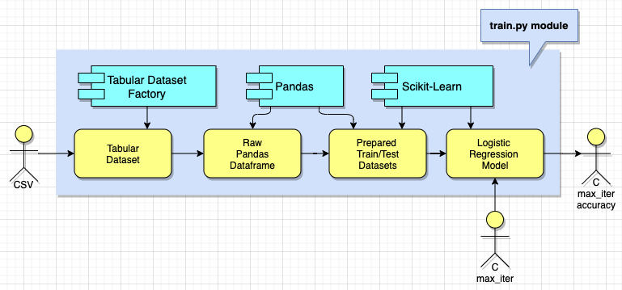
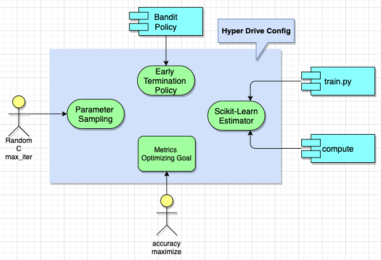
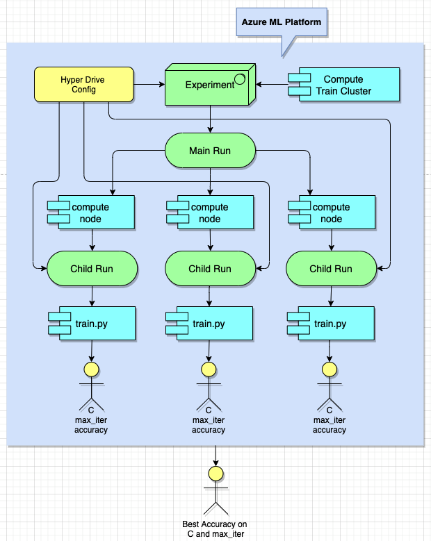

# Optimizing an ML Pipeline in Azure

## Overview

This prototype is trying 2 different approaches available on Microsoft Azure ML platform to optimize a ML pipeline: 
1. HyperDrive: Build an Azure ML pipeline using the Python SDK and Scikit-Learn model, then use HypterDrive to optimize for best hyperparameters
2. Automated Machine Learning (AutoML): On the same dataset, leverage Azure AutoML to select the best ML algorithm and its hyperparameters
   
Then the results of the two methods are compared to see which approach is better.

## Summary

The dataset was originated from [UCI Data Repository](https://archive.ics.uci.edu/ml/datasets/bank+marketing) but also hosted on [Microsoft Azure Open Dataset](https://automlsamplenotebookdata.blob.core.windows.net/automl-sample-notebook-data/bankmarketing_train.csv).

The data is related with direct marketing campaigns of a Portuguese banking institution. The marketing campaigns were based on phone calls. Often, more than one contact to the same client was required, in order to access if the product (bank term deposit) would be ('yes') or not ('no') subscribed.

**Dataset details:**

Input variables:

*Bank client data:*

1. age (numeric)
2. job: type of job (categorical: 'admin.','blue-collar','entrepreneur','housemaid','management','retired','self-employed','services','student','technician','unemployed','unknown')
3. marital: marital status (categorical: 'divorced','married','single','unknown'; note: 'divorced' means divorced or widowed)
4. education (categorical: 'basic.4y','basic.6y','basic.9y','high.school','illiterate','professional.course','university.degree','unknown')
5. default: has credit in default? (categorical: 'no','yes','unknown')
6. housing: has housing loan? (categorical: 'no','yes','unknown')
7. loan: has personal loan? (categorical: 'no','yes','unknown')

*Related with the last contact of the current campaign:*

8. contact: contact communication type (categorical: 'cellular','telephone')
9. month: last contact month of year (categorical: 'jan', 'feb', 'mar', ..., 'nov', 'dec')
10. day_of_week: last contact day of the week (categorical: 'mon','tue','wed','thu','fri')
11. duration: last contact duration, in seconds (numeric). Important note: this attribute highly affects the output target (e.g., if duration=0 then y='no'). Yet, the duration is not known before a call is performed. Also, after the end of the call y is obviously known. Thus, this input should only be included for benchmark purposes and should be discarded if the intention is to have a realistic predictive model.

*Other attributes:*

12. campaign: number of contacts performed during this campaign and for this client (numeric, includes last contact)
13. pdays: number of days that passed by after the client was last contacted from a previous campaign (numeric; 999 means client was not previously contacted)
14. previous: number of contacts performed before this campaign and for this client (numeric)
15. poutcome: outcome of the previous marketing campaign (categorical: 'failure','nonexistent','success')

*Social and economic context attributes:*

16. emp.var.rate: employment variation rate - quarterly indicator (numeric)
17. cons.price.idx: consumer price index - monthly indicator (numeric)
18. cons.conf.idx: consumer confidence index - monthly indicator (numeric)
19. euribor3m: euribor 3 month rate - daily indicator (numeric)
20. nr.employed: number of employees - quarterly indicator (numeric)

Output variable (desired target):

21. y - has the client subscribed a term deposit? (binary: 'yes', 'no')

The classification goal is to predict if the client will subscribe (yes/no) a term deposit (variable y). AutoML approach gave a little better performance (**accuracy = 91.66%**) than HyperDrive approach (**accuracy = 91.29%**)

## Scikit-Learn Pipeline

The pipeline consists of custom training module in Python (./script/train.py). This train module uses Scikit-Learn to establish a LogistricRegression model, train with 2 hyperparameters:

1. Regularization Strength (*C*)
2. Max iterations (*max_iter*)

then score model performance by *accuracy* metric:

A HyperDrive run will be configured with 4 main settings:

1. Parameter Sampling: Define the method used to navigate the hyperparamter space. In this case, the RandomParameterSampling class is selected since <u>*its random sweep implementation not only performs essentially as well as grid search but also take much less time*</u>. The 2 hyperparamters will be picked as followed:

   + *C*: random float between 0.01 and 100 of an uniform distribution
   + *max_iter*: random integer between 10 and 500

2. Early Termination Policy: Define rules to terminate poorly performing runs in order to improves running time and computational efficiency. The Bandit policy is used since it helps <u>*eleminate poor runs quicker*</u>. With slack_factor = 0.1 and delay_evaluation = 5, the policy guarantees any run after the 5th interval whose metric is less than (1 / (1 + 0.1) or 91% of the current best performing run will be terminated.

3. Scikit-Learn Estimator: Declare where to find the custom training module and what is the target compute used to execute a run

4. Metrics and Optimizing Goal: Since the training module uses accuracy as the primary metrics to score model performance, the HyperDrive needs to maximize the same metric

An experiment takes in a HyperDrive configuration and starts a new HyperDrive main run on the desire compute train cluster, then the main run triggers multiple child runs, each of them is assigned different hyperparamters picked by the provided parameter sampler:

The best hyperparameters that yields the highest accuracy are:

1. Regularization Strength: 65.45
2. Max iterations: 217
3. Accuracy: 0.9129

## AutoML Pipeline

AutoML runs tried multiple ML algorithms and different hyperparameters for each algorithm: 

The best model is XGBoostClassifier with the following hyperparameters:

1. colsample_bytree = 1
2. eta = 0.2 
3. gamma = 0.1
4. learning_rate = 0.1
5. max_delta_step = 0
6. max_depth = 6
7. max_leaves = 3
8. min_child_weight = 1
9. missing = None
10. n_estimators = 50
11. n_jobs = 1
12. nthread = None
13. objective = 'reg:logistic'
14. random_state = 0
15. reg_alpha = 0
16. reg_lambda = 1.7708333333333335
17. scale_pos_weight = 1
18. seed = None
19. silent = None
20. subsample = 0.9
21. tree_method = 'auto'
22. verbose = -10
23. verbosity = 0

Top 5 global feature importances are by the following order:
1. duration
2. nr.employed
3. emp.var.rate
4. euribor3m
5. month

## Pipeline comparison

AutoML pipeline was configured to run for 30 minutes. It actually took 41m 23s to complete on a training cluster of 4 nodes while HyperDrive pipeline configured with above early termination policy took 23m 39s.

AutoML offered better accuracy 91.66% vs. 91.29% from HyperDrive because StandardScalerWrapper/XGBoostClassifier is more advanced algorithm compared to Scikit-Learn LogistricRegression. The accuracy might be higher if letting AutoML run longer and enabling Deep Learning option. 

## Future work

1. Try running AutoML on a GPU based cluster with Deep Learning enabled: Deep Learning offers huge advantages over the traditional ML algorithms. GPU cluster can reduce training time significantly.

2. Configure the run environment via pip/conda environment.yml: When trying to run the experiments from local computer, there are several Python package conflicts happened. It gonna a big issue in production. Controlling running environment with requirements.txt and/or environment.yml offers peace of mind in environment transition.

3. Find a way to debug train.py locally, it might require how to decouple getting AzureML Run object out of train.py file.
